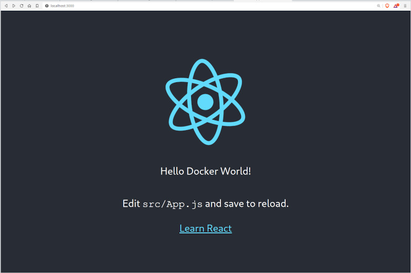

## Compose sample application
### React application with a Spring backend and a MySQL database

Project structure:
```
.
├── backend
│   ├── Dockerfile
│   ...
├── db
│   └── password.txt
├── compose.yaml
├── frontend
│   ├── ...
│   └── Dockerfile
└── README.md
```

[_compose.yaml_](compose.yaml)
```
services:
  backend:
    build: backend
    ...
  db:
    # We use a mariadb image which supports both amd64 & arm64 architecture
    image: mariadb:10.6.4-focal
    # If you really want to use MySQL, uncomment the following line
    #image: mysql:8.0.27
    ...
  frontend:
    build: frontend
    ports:
    - 3000:3000
    ...
```
The compose file defines an application with three services `frontend`, `backend` and `db`.
When deploying the application, docker compose maps port 3000 of the frontend service container to port 3000 of the host as specified in the file.
Make sure port 3000 on the host is not already being in use.

> ℹ️ **_INFO_**
> For compatibility purpose between `AMD64` and `ARM64` architecture, we use a MariaDB as database instead of MySQL.
> You still can use the MySQL image by uncommenting the following line in the Compose file
> `#image: mysql:8.0.27`

## Deploy with docker compose

```
$ docker compose up -d
Creating network "react-java-mysql-default" with the default driver
Building backend
Step 1/17 : FROM maven:3.6.3-jdk-11 AS builder
...
Successfully tagged react-java-mysql_frontend:latest
WARNING: Image for service frontend was built because it did not already exist. To rebuild this image you must use `docker-compose build` or `docker-compose up --build`.
Creating react-java-mysql-frontend-1 ... done
Creating react-java-mysql-db-1       ... done
Creating react-java-mysql-backend-1  ... done
```

## Expected result

Listing containers must show three containers running and the port mapping as below:
```
$ docker ps
ONTAINER ID        IMAGE                       COMMAND                  CREATED             STATUS              PORTS                  NAMES
a63dee74d79e        react-java-mysql-backend    "java -Djava.securit…"   39 seconds ago      Up 37 seconds                              react-java-mysql_backend-1
6a7364c0812e        react-java-mysql-frontend   "docker-entrypoint.s…"   39 seconds ago      Up 33 seconds       0.0.0.0:3000->3000/tcp react-java-mysql_frontend-1
b176b18fbec4        mysql:8.0.19                "docker-entrypoint.s…"   39 seconds ago      Up 37 seconds       3306/tcp, 33060/tcp    react-java-mysql_db-1
```

After the application starts, navigate to `http://localhost:3000` in your web browser to get a colorful message.


Stop and remove the containers
```
$ docker compose down
Stopping react-java-mysql-backend-1  ... done
Stopping react-java-mysql-frontend-1 ... done
Stopping react-java-mysql-db-1       ... done
Removing react-java-mysql-backend-1  ... done
Removing react-java-mysql-frontend-1 ... done
Removing react-java-mysql-db-1       ... done
Removing network react-java-mysql-default
```

## CI/CD with GitHub Actions
This repository now includes a GitHub Actions workflow at `.github/workflows/ci-cd.yml`.

The workflow performs the following steps:
- build the Java backend with Maven
- build the React frontend with npm
- build and push the backend and frontend Docker images to GitHub Container Registry (`ghcr.io`)
- optionally deploy the Kubernetes manifests from `k8s/` when the secret `KUBE_CONFIG_DATA` is configured

### GitHub Actions setup
1. Enable GitHub Container Registry for the repository.
2. Add the repository secret `KUBE_CONFIG_DATA` if you want deployment to Kubernetes from GitHub Actions.
   - Store the kubeconfig file as base64, e.g. `base64 ~/.kube/config | pbcopy`.

### Image names
The workflow builds and pushes the following images:
- `ghcr.io/<GITHUB_USERNAME>/kii-proekt-backend:latest`
- `ghcr.io/<GITHUB_USERNAME>/kii-proekt-frontend:latest`

Replace `<GITHUB_USERNAME>` with your GitHub username in the Kubernetes manifests before deploying.

## Kubernetes manifests
The `k8s/` directory contains manifests for deploying the app into its own namespace.

Included files:
- `namespace.yaml`
- `backend-configmap.yaml`
- `backend-secret.yaml`
- `db-service.yaml`
- `db-statefulset.yaml`
- `backend-deployment.yaml`
- `backend-service.yaml`
- `frontend-deployment.yaml`
- `frontend-service.yaml`
- `ingress.yaml`

### Deploy to Kubernetes
After configuring `kubectl` for your cluster, apply the manifests:

```bash
kubectl apply -f k8s/
```

To delete the deployment later:

```bash
kubectl delete -f k8s/
```

### Notes for Kubernetes deployment
- Use `ghcr.io/<GITHUB_USERNAME>/kii-proekt-backend:latest` and `ghcr.io/<GITHUB_USERNAME>/kii-proekt-frontend:latest` in `k8s/*-deployment.yaml`.
- The `frontend` image includes a custom Nginx proxy so `/api` requests are forwarded to the backend service.
- The database is deployed as a `StatefulSet` with a persistent volume claim.

## Project deliverables covered
- Dockerized app and database
- Docker Compose orchestration
- GitHub Actions CI/CD pipeline
- Kubernetes manifests: `Deployment`, `Service`, `Ingress`, `StatefulSet`, `ConfigMap`, and `Secret`
- Namespace deployment in a separate Kubernetes namespace

## CI/CD with GitHub Actions
This repository now includes a GitHub Actions workflow at `.github/workflows/ci-cd.yml`.

The workflow performs the following steps:
- validates the Java backend build with Maven
- validates the React frontend build with npm
- builds the backend and frontend Docker images
- pushes the images to GitHub Container Registry (`ghcr.io`)
- optionally deploys the Kubernetes manifests if `KUBE_CONFIG_DATA` is configured

### GitHub Actions setup
1. Enable GitHub Packages / GitHub Container Registry for the repository.
2. Add `KUBE_CONFIG_DATA` as a repository secret if you want automated deployment to your Kubernetes cluster.
   - store the kubeconfig file as base64, e.g. `base64 ~/.kube/config | pbcopy`

## Kubernetes manifests
The `k8s/` directory contains manifests for deploying the application in its own namespace:
- `namespace.yaml`
- `backend-configmap.yaml`
- `backend-secret.yaml`
- `db-statefulset.yaml`
- `db-service.yaml`
- `backend-deployment.yaml`
- `frontend-deployment.yaml`
- `backend-service.yaml`
- `frontend-service.yaml`
- `ingress.yaml`

### Deploy to Kubernetes
Run the following command after you have configured `kubectl` for your cluster:

```bash
kubectl apply -f k8s/
```

If you need to delete the deployment later:

```bash
kubectl delete -f k8s/
```
